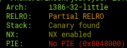
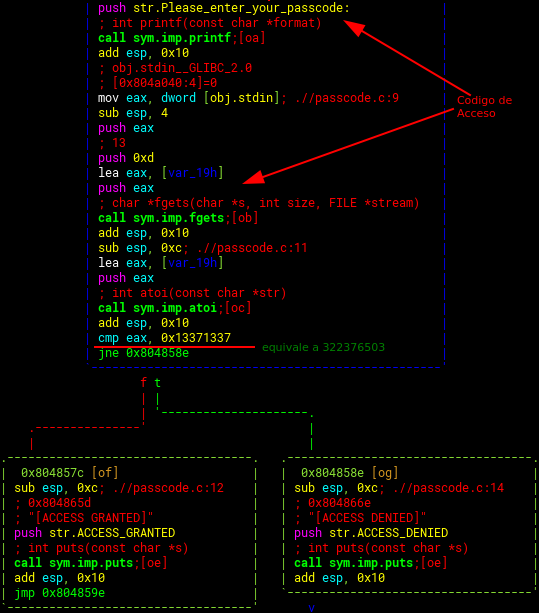
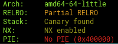
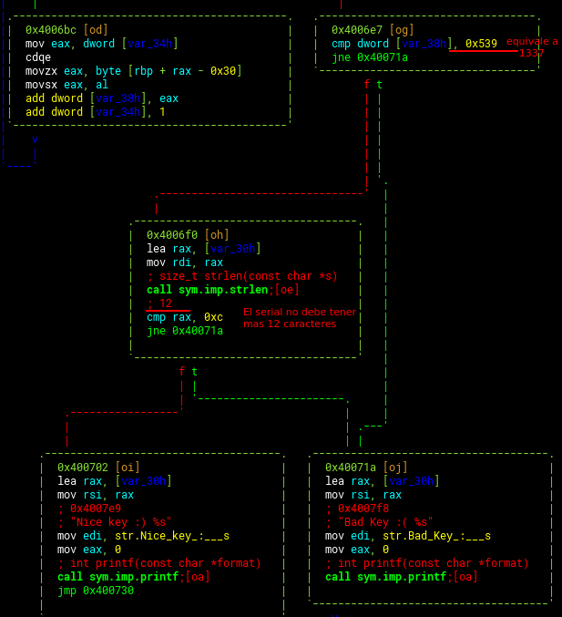
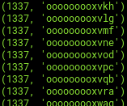

### Reversing CYBER 2019

#### Reto 1:

Nos entregan un binario elf de 32 bits



Realizando un analisis del binario con una herramienta de reversing como radare2 encontramos en la funcion "main" lo siguiente:



la bandera es  *CYBER{322376503}*


#### Reto 2 

Nos entregan un binario elf de 64 bits y nos dicen que el serial en la aplicacion es la bandera:



Analizando con una herramienta de reversing como radare2 :



Esto deja la posibilidad de millones de llaves , las cuales cumplan con la regla de sumar sus valores ascii sean igual a 1337 y solo tengan 12 digitos:

para esto una division smple no dice que el valor mas cercano y rapido seria 1337/12=111.41 aproximando por reduccion 111 que equivale a "o" , esto nos permite pensar en una mascara "mask" similar a "oooooooooooo" , a continucion probamos iterando apartir de la mascara y comparamos valores:

```python
import sys
for linea in sys.stdin:
    acu = 0
    for i in linea[:-1]:
        acu = acu + ord(i)
    if acu == 1337:
        print(acu,linea[:-1])
```

Usaremos el maskpreprocesor de hashcat y el script en python para encontrar un serial:

`mp64 -s oooooooooooo -1 ?l?d ?1?1?1?1?1?1?1?1?1?1?1?1| python suma.py  `




La llave es *CYBER{ooooooooxvkh}*
